## **Centre for Cybersecurity Institute**

**Module:** Python Fundamentals

**Project 1:** Simple Port Scanner

**File Name:** CCK3\_250714.s22.pdf

**Student Name:** Tan Amos

**Class Code:** CCK3\_250714

**Student Code:** s22

**Trainer Name: Samson**

**Date of Submission:** 2025-10-17

## **Introduction**

This project involved creating a beginner-friendly network port scanner written in Python 3.10+. It discovers live hosts, scans TCP/UDP ports (optionally with threading), shows service names and quick banners, and saves results to CSV.

### Project Goals

*   Learn to use Python's socket module.

*   Understand the basics of port scanning and network security.

*   Develop a simple tool to scan for open ports on a target system.

*   Understand the concept of open ports and why securing them is critical

### Key Features of the Port Scanner

*   Accept IP or hostname; optional live-host discovery

*   Scan TCP/UDP single ports or ranges

*   Optional multithreading for speed

*   Reverse DNS (show hostnames when available)

*   Quick banner grab (e.g., HTTP headers)

*   Smarter UDP probes (DNS/NTP/SSDP)

*   Optional RTT-based timeout auto-tuning

*   Save results to CSV (timestamped)

## Script Logic

```plain text
Inputs (target, ports, tcp/udp, threads)
│
├─ Optional Discovery (CIDR) → discover_live_hosts() → is_host_reachable()
│
└─ For each target:
    ├─ (Optional) RTT auto-tune → estimate_rtt_s() → compute_timeouts_from_rtt()
    ├─ Scan:
    │   ├─ TCP → probe_tcp_port() → [banner if HTTP] → get_service_name()
    │   └─ UDP → probe_udp_port() → (open / closed / open|filtered)
    ├─ Reverse DNS label (best-effort) → reverse_dns()
    └─ Save → write_results_csv()  (target, proto, port, service, banner, timestamp)
```

*   **Discovery:** Tries quick TCP/UDP reachability to list “live” hosts before scanning.

*   **RTT auto-tune:** Measures median round-trip time and adjusts timeouts so slow links still complete.

*   **TCP banners:** Sends a tiny HTTP `HEAD` on webish ports; for others, a harmless newline to coax banners.

*   **UDP reality:** No handshake; “no reply” often means **open|filtered**. Known probes (DNS/NTP/SSDP) improve accuracy.

*   **Threading:** Uses a thread pool for I/O-bound scans to speed things up without hammering the host.

*   **CSV output:** Safe for spreadsheets (formula-injection guarded) and easy to compare runs over time.

***

***

## Lab Demonstration

> **Legal / Ethical Use**

    Only scan systems you own or have written permission to test. Public targets listed here are safe to use for learning; do not scan random hosts on the internet

## Setup

I intentionally exposed a small set of ports so my scanner has something legitimate to find. Everything else was kept closed/blocked.

### Ubuntu Server — SSH, HTTP, and UDP

**Enable SSH (port 22)**

**Why:** secure remote login; common baseline service to scan.

```bash
sudo apt update
sudo apt install -y openssh-server
sudo systemctl enable --now ssh
```

**Enable HTTP (port 80)**

**Why:** easy banner to grab (HTTP headers) for demo.

```bash
sudo apt install -y apache2
sudo systemctl enable --now apache2
```

**UDP (port 1900)**

**Why:** show a UDP “open” with a short banner reply (SSDP-style).

```bash
sudo python3 - <<'PY'
import socket
s = socket.socket(socket.AF_INET, socket.SOCK_DGRAM)
s.bind(('0.0.0.0', 1900))
print("UDP 1900 demo running… (Ctrl+C to stop)")
while True:
    data, addr = s.recvfrom(1024)
    s.sendto(b'HTTP/1.1 200 OK\r\nSERVER: lab-ssdp-demo\r\n\r\n', addr)
PY
```

**Verification:**

**Screenshot — Ubuntu: SSH (22) and HTTP (80) listening**.

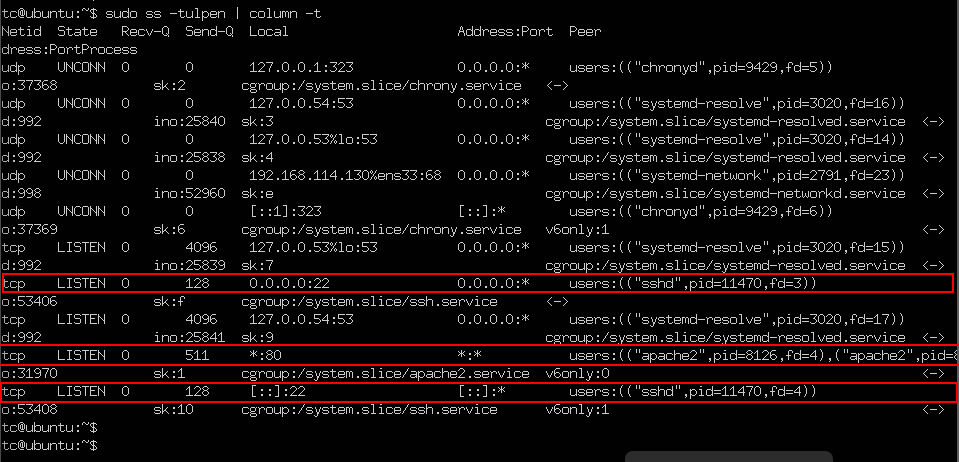

Screenshot - Ubuntu: UDP on port 1900

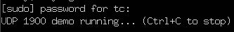

**Screenshot — Ubuntu target reachable (SSH 22 & HTTP 80)**

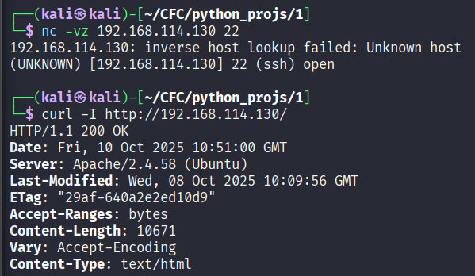

## **Windows 10 — RDP and SMB**

**Why:** realistic Windows services to detect.

> Run the following in CMD as Administrator.

**Enable RDP (port 3389)**

```shell
rem Start/enable Remote Desktop Services 
sc config TermService start= auto
sc start TermService

rem Open the firewall 
netsh advfirewall firewall add rule name="Lab Allow RDP 3389" dir=in action=allow protocol=TCP localport=3389

```

**Enable SMB file sharing (port 445)**

```shell
rem Start/enable the Server (SMB) service
sc config lanmanserver start= auto
sc start lanmanserver

rem Open the firewall 
netsh advfirewall firewall add rule name="Lab Allow SMB 445" dir=in action=allow protocol=TCP localport=445
```

**Verification:**

**Screenshot — Windows: RDP (3389) & SMB (445) allowed + listening**

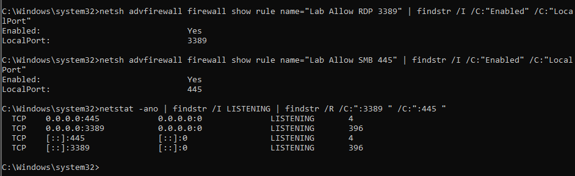

**Screenshot — Windows target reachable (RDP 3389 & SMB 445)**

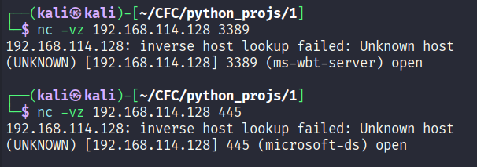

### Summary

| Host          | Role     | IP              | Open Ports     |
| ------------- | -------- | --------------- | -------------- |
| Kali Linux    | Scanner  | 192.168.114.129 | —              |
| Ubuntu Server | Target A | 192.168.114.130 | TCP 22 (SSH)   |
| TCP 80 (HTTP) |          |                 |                |
| UDP 1900      |          |                 |                |
| Windows 10    | Target B | 192.168.114.128 | TCP 3389 (RDP) |
| TCP 445 (SMB) |          |                 |                |

**Screenshot — Launching the Script**

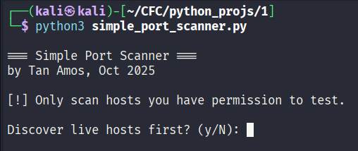

## Usage — Discovery on /24 then TCP Scan

**Goal:** Discover hosts on my lab subnet (`192.168.114.0/24`) and scan the four ports I enabled.

**Inputs**

*   `Discover live hosts first?` → **y**

*   `Enter IP or CIDR` → **192.168.114.0/24**

*   `Use threads for discovery (hosts)?` → **y** → workers: **ENTER**

*   `Resolve reverse DNS for live hosts in the list?` → **n**

*   `Select hosts (e.g., 1-3,5 or 'all')` → **4, 2** (to select 192.168.114.130 and .128)

*   `Enter ports/ranges` → **22, 80, 445, 3389**

*   `Scan mode` → **tcp**

*   `Use threads for scanning (ports)?` → **y** → workers: **ENTER**

*   `Enable RTT-based autotuning of timeouts?` → n

**Outputs**

*   Ubuntu (192.168.114.130): **OPEN** on **22 (ssh)** and **80 (http)** with an HTTP header banner.

*   Windows (192.168.114.128): **OPEN** on **445 (microsoft-ds)** and **3389 (ms-wbt-server)**.

**Screenshot — Discovery (/24) + TCP scan (Ubuntu & Windows)**

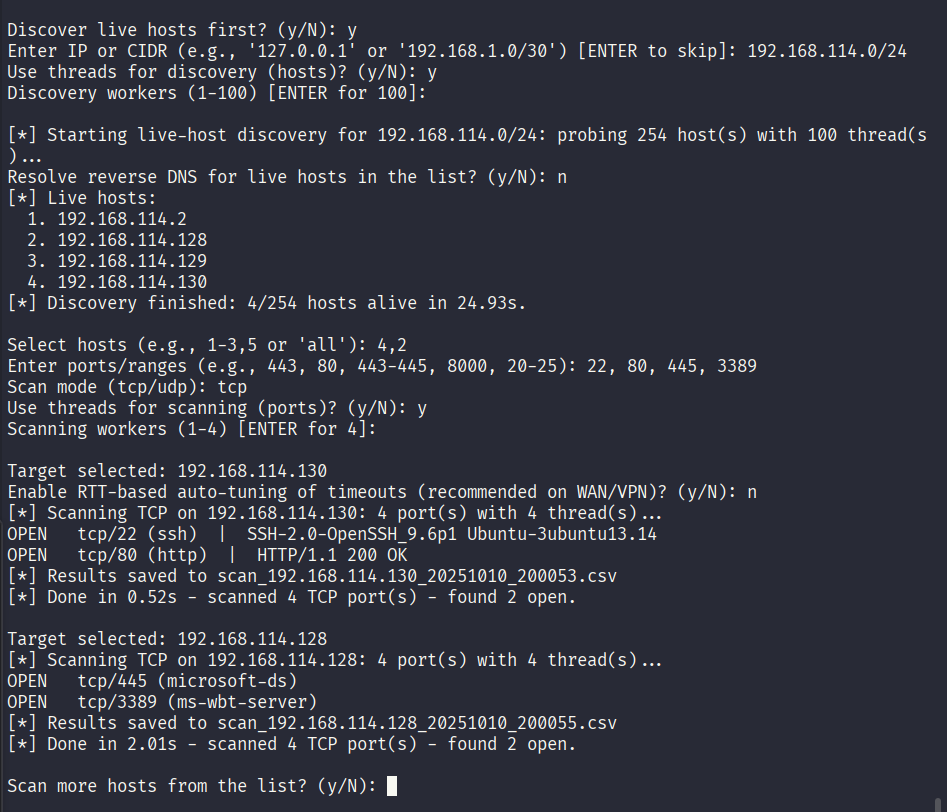

## Usage — UDP Scan

**Goal:** Scan common UDP services and confirm my custom UDP responder on port **1900** returns a banner.

**Inputs**

*   `Discover live hosts first?` → **n**

*   `Enter target` → **192.168.114.130**

*   `Enter ports/ranges` → **53, 123, 1900**

*   `Scan mode` → **udp**

*   `Use threads for scanning (ports)?` → **y** → workers: **ENTER**

*   `Enable RTT-based auto-tuning of timeouts?` → **n**

*   `Also show non-open UDP results (CLOSED / OPEN|FILTERED)?` → **y**

**Outputs**

*   Ubuntu (192.168.114.130): **OPEN** on **udp/1900 (ssdp)** with a short banner (e.g., `HTTP/1.1 200 OK`).

*   UDP **53** and **123**: shown as **OPEN|FILTERED** or **CLOSED** (no banner), demonstrating typical UDP ambiguity.

**Screenshot — UDP scan (1900 open with banner; 53/123 non-open)**

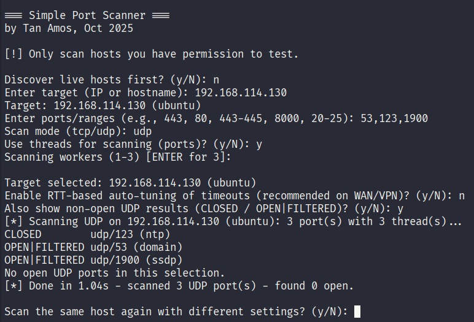

## Usage — TCP Banner & CSV Output (Ubuntu http/80)

**Goal:** Show a readable banner on TCP 80 and confirm results are saved to CSV.

**Inputs**

*   `Discover live hosts first?` → **n**

*   `Enter target` → **192.168.114.130**

*   `Enter ports/ranges` → **80**

*   `Scan mode` → **tcp**

*   `Enable RTT-based auto-tuning of timeouts?` → **n**

**Outputs**

*   `OPEN tcp/80 (http) | ...` (first HTTP header line as the banner)

*   `[*] Results saved to scan_192.168.114.130_<timestamp>.csv`

**Screenshot — TCP banner on 80 + CSV saved**

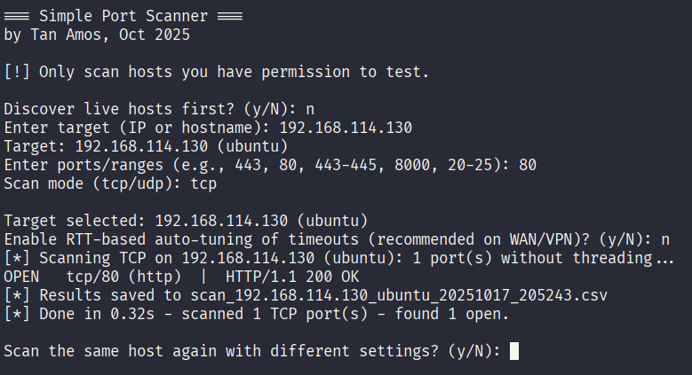

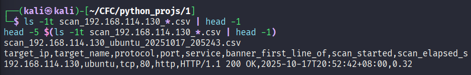

## Usage — Public Targets, RTT auto-tuning, Multithreading

Only scan hosts that explicitly permit it.

*   [**scanme.nmap.org**](http://scanme.nmap.org/) — Allowed for light port-scanning only (no exploits/DoS). Limit yourself to a few scans per day.

*   [**portquiz.net**](http://portquiz.net/) — Listens on **all TCP ports** to help test outbound connectivity; use a tiny subset of ports (e.g., 80, 8080, 12345).

### Demo 1 — [scanme.nmap.org](http://scanme.nmap.org/)

**Goal:** Show a lightweight public scan, demonstrate RTT-based auto-tuning, multithreading, and repeated scans on the same host.

> Start a fresh run of the script so the auto-tuning prompt appears.

**Inputs**

*   `Discover live hosts first?` → **n**

*   `Enter target` → [**scanme.nmap.org**](http://scanme.nmap.org/)

*   `Enter ports/ranges` → 1-100

*   `Scan mode` → **tcp**

*   `Use threads for scanning (ports)?` → (1st run) **n , (2nd run) y** → 50 workers

*   `Enable RTT-based auto-tuning of timeouts?` → **y**

*   `Scan the same host again with different settings?` → **y**

**Outputs**

*   `[*] RTT auto-tune: RTT≈<X>ms -> TCP=<a>s, Banner=<b>s, UDP=<c>s`

*   A few **OPEN** lines (varies over time), and

*   Significantly faster 2nd run (with multithreads) than 1st

**Screenshot — Public scan (**[**scanme.nmap.org**](http://scanme.nmap.org/)**, auto-tuned)**

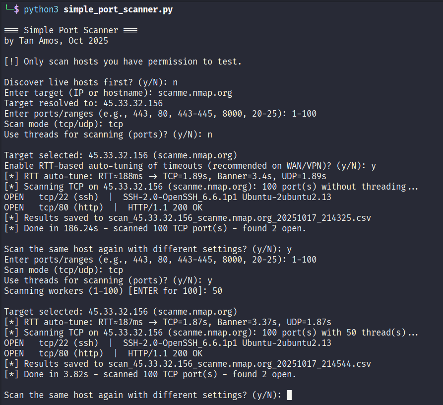

### Demo 2 — [portquiz.net](http://portquiz.net/)

**Goal:** Confirm banners on arbitrary TCP ports and (if prompted) keep auto-tuning enabled.

**Inputs**

*   `Discover live hosts first?` → **n**

*   `Enter target` → [**portquiz.net**](http://portquiz.net/)

*   `Enter ports/ranges` → **1-65535**

*   `Scan mode` → **tcp**

*   `Use threads for scanning (ports)?` → **y** → workers: **ENTER**

*   `Enable RTT-based auto-tuning of timeouts?` → **y** *(only if prompted; it’s asked once per run)*

**Outputs**

*   **OPEN** on some ports, with short HTTP banner.

***

## Limitations

*   **IPv4-only.** The scanner rejects IPv6 input and skips AAAA records.

*   **Connect scans only.** Uses full TCP `connect()`; no SYN/half-open scanning (needs raw sockets).

*   **UDP ambiguity.** Anything without a reply becomes **open|filtered**; only a few smart probes (DNS/NTP/SSDP) are implemented.

*   **Tight timeouts can miss slow hosts.** Auto-tuning helps, but false negatives are still possible on noisy/slow links.

*   **Basic banner grab.** No TLS handshake or protocol-specific parsing beyond minimal HTTP; limited service fingerprinting.

*   **Interactive CLI.** Prompts are great for learning, but not ideal for automation/CI.

*   **Single-run CSV only.** No JSON output, HTML report, or side-by-side diff between runs.

*   **No evasion/rate limiting.** Doesn’t adapt to IDS/IPS or throttle automatically.

*   **No OS/version detection.** Doesn’t do stack fingerprinting or full service detection.

**Potential next features**

*   **IPv6 support** and dual-stack resolution.

*   **SYN scan mode** (e.g., via `scapy`/raw sockets) + privileged fallback.

*   **Richer UDP probes** (SNMP/161, TFTP/69, DHCP/67, etc.) and retry/backoff logic.

*   **Config profiles** (`-fast`, `-full`, `-top-1000`) and an **exclusion list**.

*   **Machine-readable outputs** (JSON), plus **HTML/PDF** summary and **diff reports** between runs.

*   **Rate limiting** and polite delays; optional **randomized port order**.

*   **Headless mode/CLI flags** (no prompts) for scripting and CI pipelines.

***

## Conclusion

This project taught me the mechanisms behind network scanners:

*   I used Python’s **socket** API to perform **TCP connect** and **UDP probe** scans.

*   I practiced **parsing inputs** (ports/ranges, CIDR), **reverse DNS**, and mapping ports to **well-known services**.

*   I saw why **UDP is tricky** (no handshake; many services don’t reply) and how small, protocol-aware probes improve accuracy.

*   I implemented a simple **banner grab** to turn raw ports into human-friendly results.

*   I added **CSV output** safely (formula-injection guarded) to make results useful outside the terminal.

*   I experimented with **multithreading** and a basic **RTT-based auto-tuning** to balance speed vs. reliability.

*   Most importantly, I built good **security hygiene**: enable only the services I intend to expose, verify from multiple angles, and respect ethical boundaries when scanning.

I now understand the mechanics and trade-offs of port scanning and can explain why tools like Nmap behave the way they do. The next steps above would move this from a learning tool toward a more production-grade scanner.

**End of Report**

***

## References

| \[1]  | Infosec, “Write a port scanner in Python in 5 minutes,” YouTube video. Accessed: Oct. 17, 2025. \[Online]. Available: [https://www.youtube.com/watch?v=t9EX2RAUoTU](https://www.youtube.com/watch?v=t9EX2RAUoTU\&utm_source=chatgpt.com) [YouTube](https://www.youtube.com/watch?v=t9EX2RAUoTU\&utm_source=chatgpt.com)                                                                                         |
| ----- | --------------------------------------------------------------------------------------------------------------------------------------------------------------------------------------------------------------------------------------------------------------------------------------------------------------------------------------------------------------------------------------------------------------- |
| \[2]  | D. Bombal, “Python nmap port scanner,” YouTube video. Accessed: Oct. 17, 2025. \[Online]. Available: [https://www.youtube.com/watch?v=x4AE5yOF9pE](https://www.youtube.com/watch?v=x4AE5yOF9pE\&utm_source=chatgpt.com) [YouTube](https://www.youtube.com/watch?v=x4AE5yOF9pE\&utm_source=chatgpt.com)                                                                                                          |
| \[3]  | D. Bombal, “pythonvideos” (code examples), GitHub repository. Accessed: Oct. 17, 2025. \[Online]. Available: [https://github.com/davidbombal/pythonvideos](https://github.com/davidbombal/pythonvideos?utm_source=chatgpt.com) [GitHub](https://github.com/davidbombal/pythonvideos?utm_source=chatgpt.com)                                                                                                     |
| \[4]  | Python Software Foundation, “socket — Low-level networking interface,” *Python 3 Standard Library*. Accessed: Oct. 17, 2025. \[Online]. Available: [https://docs.python.org/3/library/socket.html](https://docs.python.org/3/library/socket.html?utm_source=chatgpt.com) [Python documentation](https://docs.python.org/3/library/socket.html?utm_source=chatgpt.com)                                           |
| \[5]  | Python Software Foundation, “Socket Programming HOWTO,” *Python 3 Docs*. Accessed: Oct. 17, 2025. \[Online]. Available: [https://docs.python.org/3/howto/sockets.html](https://docs.python.org/3/howto/sockets.html?utm_source=chatgpt.com) [Python documentation](https://docs.python.org/3/howto/sockets.html?utm_source=chatgpt.com)                                                                         |
| \[6]  | Real Python, “Socket Programming in Python (Guide),” Dec. 7, 2024. Accessed: Oct. 17, 2025. \[Online]. Available: [https://realpython.com/python-sockets/](https://realpython.com/python-sockets/?utm_source=chatgpt.com) [Real Python](https://realpython.com/python-sockets/?utm_source=chatgpt.com)                                                                                                          |
| \[7]  | Python Software Foundation, “ipaddress — IPv4/IPv6 manipulation library,” *Python 3 Standard Library*. Accessed: Oct. 17, 2025. \[Online]. Available: [https://docs.python.org/3/library/ipaddress.html](https://docs.python.org/3/library/ipaddress.html?utm_source=chatgpt.com) [Python documentation](https://docs.python.org/3/library/ipaddress.html?utm_source=chatgpt.com)                               |
| \[8]  | Python Software Foundation, “concurrent.futures — Launching parallel tasks,” *Python 3 Standard Library*. Accessed: Oct. 17, 2025. \[Online]. Available: [https://docs.python.org/3/library/concurrent.futures.html](https://docs.python.org/3/library/concurrent.futures.html?utm_source=chatgpt.com) [Python documentation](https://docs.python.org/3/library/concurrent.futures.html?utm_source=chatgpt.com) |
| \[9]  | Nmap Project, “Go ahead and ScanMe!” (public target usage policy). Accessed: Oct. 17, 2025. \[Online]. Available: [https://scanme.nmap.org/](https://scanme.nmap.org/?utm_source=chatgpt.com) [scanme.nmap.org](https://scanme.nmap.org/?utm_source=chatgpt.com)                                                                                                                                                |
| \[10] | Portquiz.net, “This server listens on all TCP ports.” Accessed: Oct. 17, 2025. \[Online]. Available: [https://portquiz.net/](https://portquiz.net/?utm_source=chatgpt.com) [portquiz.net](https://portquiz.net/?utm_source=chatgpt.com)                                                                                                                                                                         |
| \[11] | Python Wiki, “UDP Communication.” Accessed: Oct. 17, 2025. \[Online]. Available: [https://wiki.python.org/moin/UdpCommunication](https://wiki.python.org/moin/UdpCommunication?utm_source=chatgpt.com) [Python Wiki](https://wiki.python.org/moin/UdpCommunication?utm_source=chatgpt.com)                                                                                                                      |
